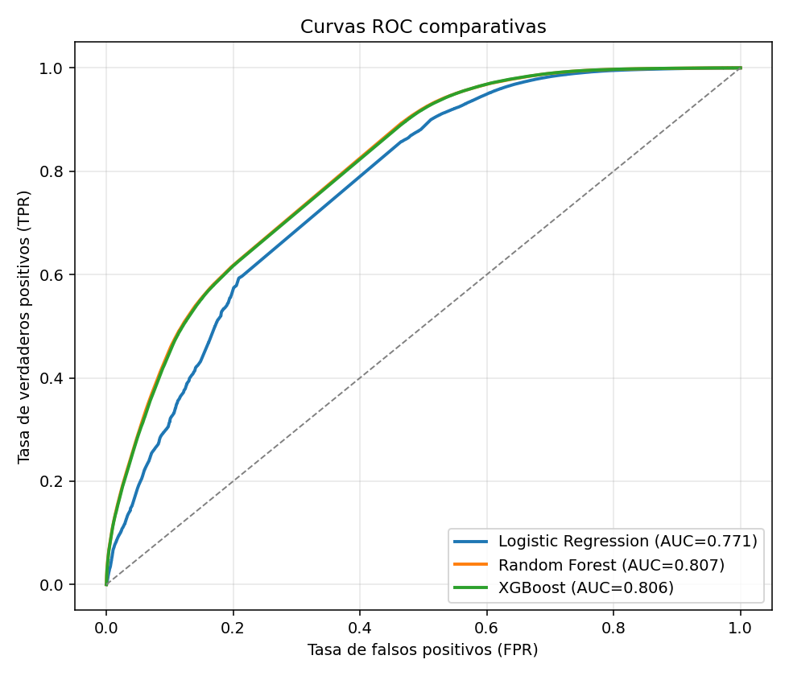
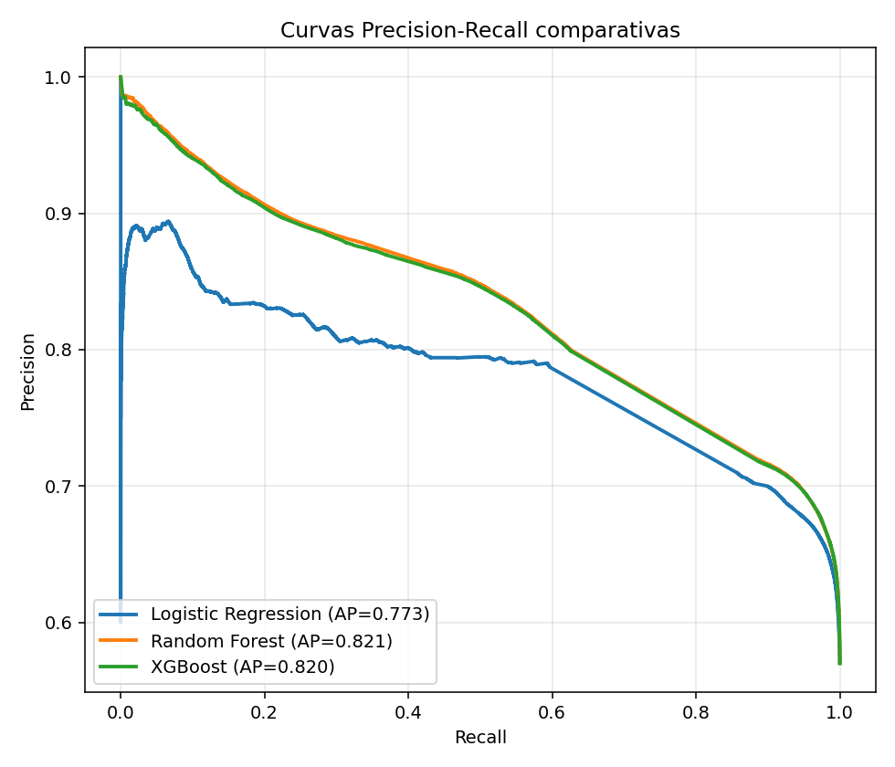
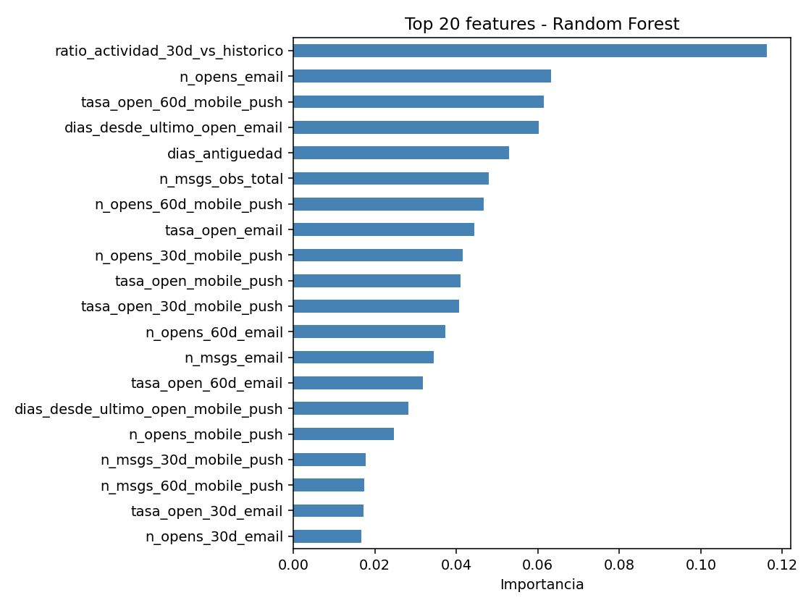
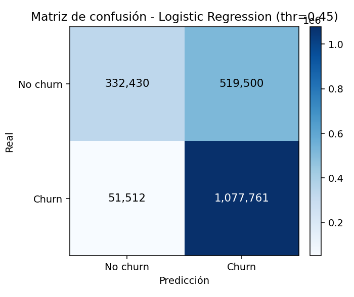
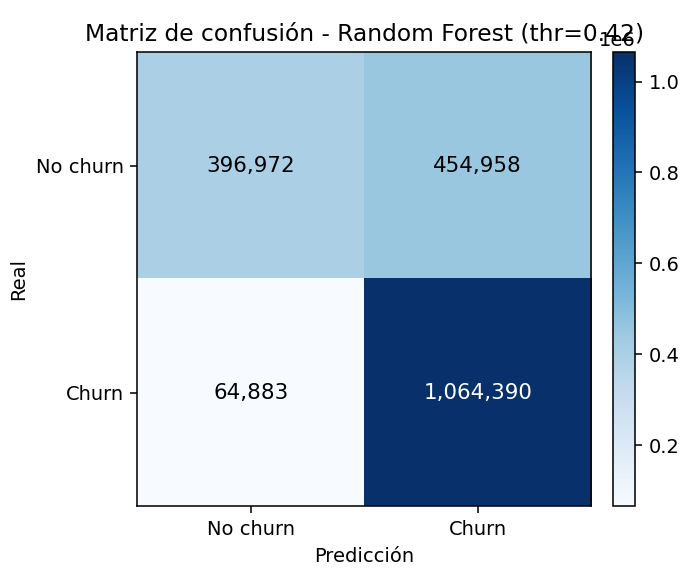
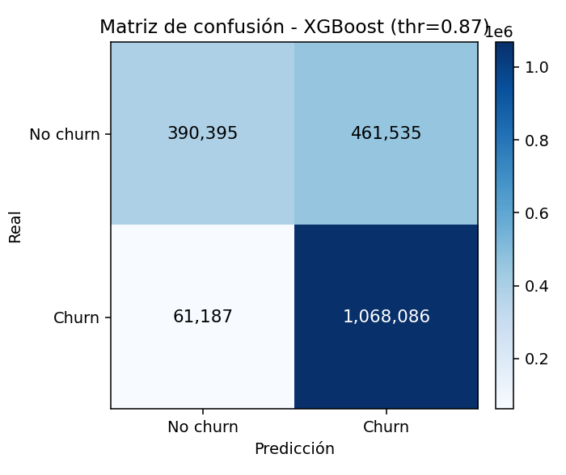

# Predicción de Churn de Comunicación CRM Multicanal

Pipeline de Machine Learning para predecir qué usuarios dejarán de interactuar con campañas de mensajería multicanal (email y mobile push) en un retailer mediano.

Paper: _"Predicción de churn de comunicación en campañas CRM multicanal mediante aprendizaje automático"_ — Trenyan, A. (2026).

---

## Resultados

Evaluación sobre **~1.98M usuarios** (ventana 2022-10-23 → 2023-04-23), con intervalo de confianza 95% por bootstrap (200 iteraciones):

| Modelo | AUC-ROC | PR-AUC | F1 | Precision | Recall |
|---|---|---|---|---|---|
| Logistic Regression | 0.771 | 0.773 | 0.791 | 0.675 | 0.954 |
| **Random Forest** | **0.807** | **0.821** | **0.804** | **0.701** | **0.943** |
| XGBoost | 0.806 | 0.820 | 0.803 | 0.698 | 0.946 |

**Modelo ganador: Random Forest** (mejor AUC-ROC y PR-AUC).

Threshold óptimo elegido por máximo F1 en test. Ver reporte completo en [`outputs/report.md`](outputs/report.md).

### Curvas ROC y Precision-Recall





### Importancia de features — Random Forest



### Matrices de confusión

| Logistic Regression | Random Forest | XGBoost |
|---|---|---|
|  |  |  |

---

## Estructura del repositorio

```
codigo/
├── run.py                  # Entrypoint del pipeline
├── config.json             # Hiperparámetros y configuración global
├── requirements.txt        # Dependencias Python
├── explorar_dataset.py     # Script de exploración inicial
├── paper.tex               # Fuente LaTeX del paper
├── referencias.bib         # Bibliografía BibTeX
├── src/
│   ├── data.py             # Fase 1: carga y validación
│   ├── features.py         # Fase 2: ingeniería de features
│   ├── train.py            # Fase 3: entrenamiento (LR, RF, XGB)
│   ├── evaluate.py         # Fase 4: evaluación y figuras
│   └── logging_utils.py    # Logger y helpers compartidos
├── data/                   # ← vacío en el repo; completar con el dataset
└── outputs/
    ├── figures/            # Figuras generadas (versionadas)
    ├── report.md           # Reporte de resultados (versionado)
    ├── models/             # Modelos .pkl (no versionados, se regeneran)
    ├── features/           # Features .parquet (no versionados)
    └── logs/               # Logs de corridas (no versionados)
```

---

## Configuración del entorno

**Requisitos**: Python 3.11.x

```bash
# Crear entorno virtual e instalar dependencias
python3.11 -m venv venv
source venv/bin/activate        # Windows: venv\Scripts\activate
pip install -r requirements.txt
```

---

## Descarga del dataset

El pipeline requiere 4 archivos en la carpeta `data/`:

### Archivos auxiliares (Kaggle)

Descargar el dataset [**Direct Messaging**](https://www.kaggle.com/datasets/mkechinov/direct-messaging) de Kaggle y copiar los siguientes archivos a `data/`:

- `campaigns.csv`
- `holidays.csv`
- `client_first_purchase_date.csv`

```bash
# Con la CLI de Kaggle (pip install kaggle)
kaggle datasets download mkechinov/direct-messaging --unzip -p data/
```

### Dataset completo de mensajes

`messages.csv.gz` (21.5 GB comprimido, ~721M filas) se descarga directamente desde REES46:

```bash
wget -P data/ https://data.rees46.com/datasets/direct-messaging/messages.csv.gz
```

> **Nota**: La descarga pesa ~21.5 GB. El pipeline procesa el archivo comprimido por streaming (sin descomprimir a disco), por lo que se requiere ~30 GB libres en total.

**MD5 esperado** del archivo completo: `95fa332ef970a50c6c18a916b79f99af`

```bash
# Verificar integridad
md5sum data/messages.csv.gz   # Linux
md5 data/messages.csv.gz      # macOS
```

---

## Ejecución del pipeline

El pipeline tiene 4 fases que se pueden correr en conjunto o de forma individual:

```bash
# Correr las 4 fases en orden (recomendado primera vez)
python run.py

# Correr una fase puntual
python run.py --phase data        # Fase 1: validación del dataset
python run.py --phase features    # Fase 2: ingeniería de features (~9h en CPU)
python run.py --phase train       # Fase 3: entrenamiento de modelos
python run.py --phase evaluate    # Fase 4: evaluación y generación de figuras

# Forzar recálculo de features (ignora cache)
python run.py --phase features --force
```

### Tiempos estimados (CPU, sin GPU)

| Fase | Tiempo aproximado |
|---|---|
| Fase 1 — validación | ~30–60 min (lectura MD5 + streaming) |
| Fase 2 — features | ~9–12 h (procesamiento de 721M filas) |
| Fase 3 — entrenamiento | ~2–4 h (búsqueda hiperparámetros + refit) |
| Fase 4 — evaluación | ~15–30 min (bootstrap 200 iters) |

> Las fases 3 y 4 generan artefactos con timestamp en `outputs/models/` y `outputs/figures/`.

### Configuración

Los parámetros del pipeline se controlan desde `config.json`:

| Parámetro | Valor por defecto | Descripción |
|---|---|---|
| `seed` | 42 | Semilla global de aleatoriedad |
| `ventana_observacion_meses` | 18 | Meses de historial para las features |
| `ventana_evaluacion_meses` | 6 | Horizonte de predicción |
| `smote_threshold` | 0.2 | Umbral de desbalance para aplicar SMOTE |
| `random_search_n_iter` | 20 | Iteraciones de RandomizedSearchCV |
| `cv_folds` | 5 | Folds de cross-validation |
| `bootstrap_iters` | 200 | Iteraciones para CI 95% |
| `chunksize_messages` | 500 000 | Filas por chunk al leer `messages.csv.gz` |
| `subsample_busqueda` | 500 000 | Subsample para búsqueda de hiperparámetros |

---

## Metodología (resumen)

- **Target**: churn de comunicación = usuario que no abre ni hace clic en ningún mensaje de email o mobile push durante la ventana de evaluación (6 meses).
- **Features**: 20+ variables por usuario (tasas de apertura, clic, rebote, desuscripción, frecuencia de envíos, antigüedad, comportamiento por día de semana, etc.).
- **Split**: temporal estricto (train ≤ corte de observación < test).
- **Modelos**: Logistic Regression (baseline), Random Forest, XGBoost.
- **Evaluación**: AUC-ROC, PR-AUC, F1, Precision, Recall con threshold óptimo y bootstrapping.

---

## Tecnologías

| Librería | Versión |
|---|---|
| Python | 3.11.4 |
| pandas | 3.0.3 |
| numpy | 2.4.4 |
| scikit-learn | 1.8.0 |
| xgboost | 3.2.0 |
| imbalanced-learn | 0.14.1 |
| matplotlib | 3.10.9 |
| pyarrow | 24.0.0 |
