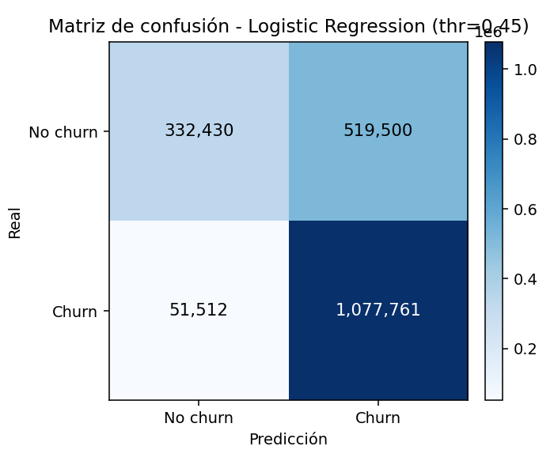
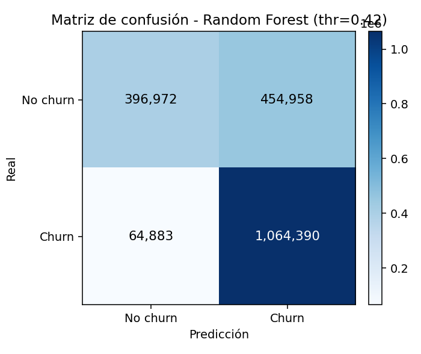
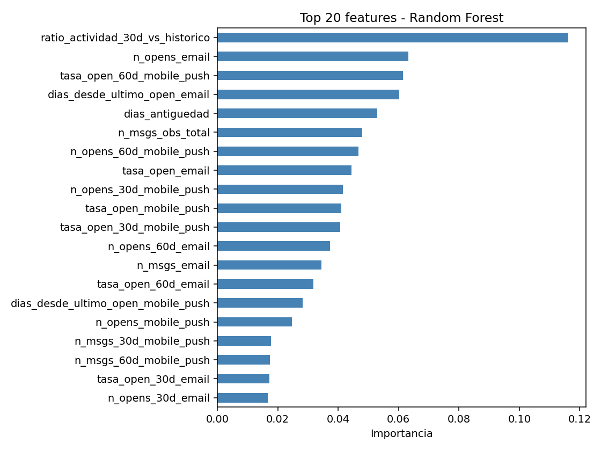
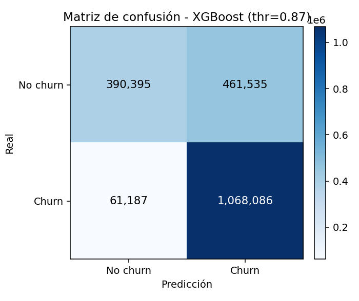
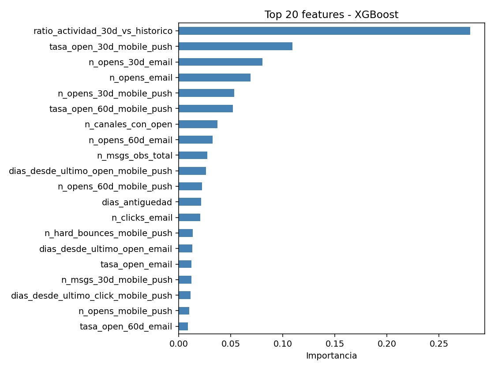
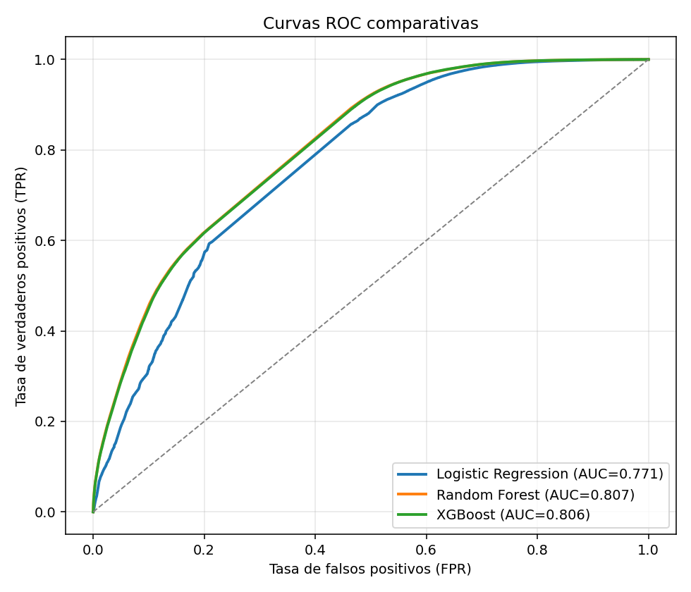
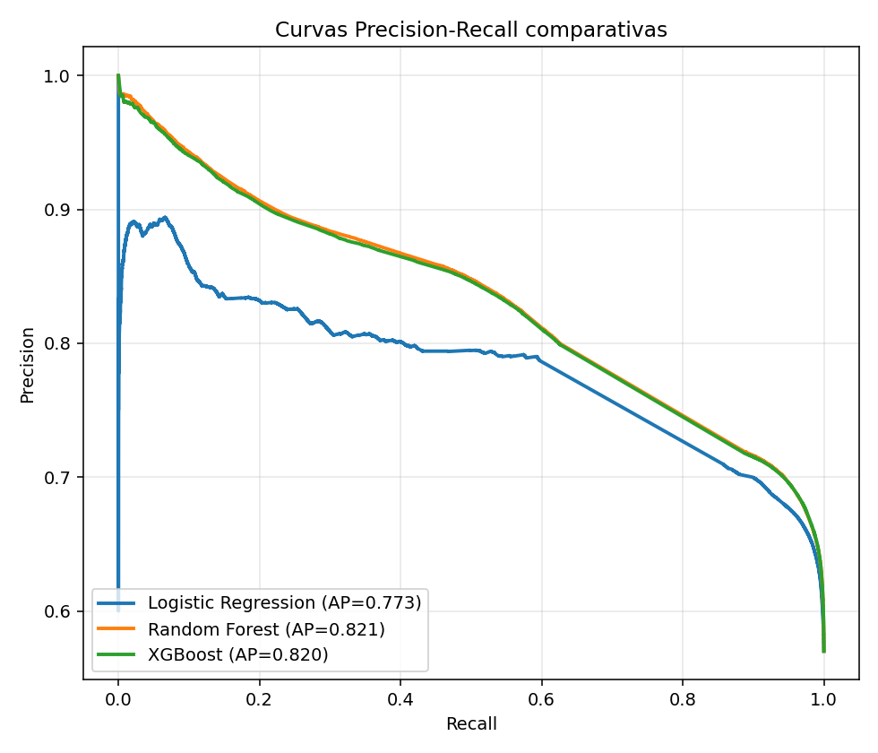

# Results report - multichannel CRM communication churn

_Generated: 20260519_152108_

## Methodology (summary for the paper)

- **D1 Time window**: observation = 2021-04-23T23:59:29 → 2022-10-23T23:59:29 (18 months). Evaluation = 2022-10-23T23:59:29 → 2023-04-23T23:59:29 (6 months). Counted backwards from `max(sent_at)`.
- **D2 Purchase attribution**: `is_purchased` is used as it comes in the dataset (source CRM attribution).
- **D3 Features**: closed list from paper sec. IV.C. No additional undocumented features.
- **D4 Environment**: Python 3.11.4, pandas/sklearn/xgboost/imblearn stack. Global SEED = 42.
- **D5 Dataset**: `messages.csv.gz` (24 months, 721M raw rows), downloaded from `data.rees46.com`. Processed via gzip streaming + chunks (never decompressed to disk).

## Split and imbalance

- Train size: 7,924,808 | Test size: 1,981,203
- Churn prevalence in train: 0.5700
- Churn prevalence in test:  0.5700
- SMOTE applied: **False** (threshold = 0.2)

## Comparative results (optimal F1 threshold)

Metrics with 95% bootstrap confidence intervals (200 iterations).

| Model | AUC-ROC | PR-AUC | F1 | Precision | Recall | Threshold |
|---|---|---|---|---|---|---|
| Logistic Regression | 0.771 [0.771, 0.772] | 0.773 [0.772, 0.774] | 0.791 [0.790, 0.791] | 0.675 [0.674, 0.675] | 0.954 [0.954, 0.955] | 0.448 |
| Random Forest | 0.807 [0.806, 0.808] | 0.821 [0.821, 0.822] | 0.804 [0.803, 0.804] | 0.701 [0.700, 0.701] | 0.943 [0.942, 0.943] | 0.416 |
| XGBoost | 0.806 [0.805, 0.806] | 0.820 [0.819, 0.820] | 0.803 [0.803, 0.804] | 0.698 [0.698, 0.699] | 0.946 [0.945, 0.946] | 0.868 |

**Winning model (best AUC-ROC):** Random Forest.

## Results at the default threshold (0.5)

| Model | AUC-ROC | PR-AUC | F1 | Precision | Recall |
|---|---|---|---|---|---|
| Logistic Regression | 0.771 | 0.773 | 0.790 | 0.681 | 0.941 |
| Random Forest | 0.807 | 0.821 | 0.801 | 0.711 | 0.918 |
| XGBoost | 0.806 | 0.820 | 0.778 | 0.639 | 0.994 |

## Figures

